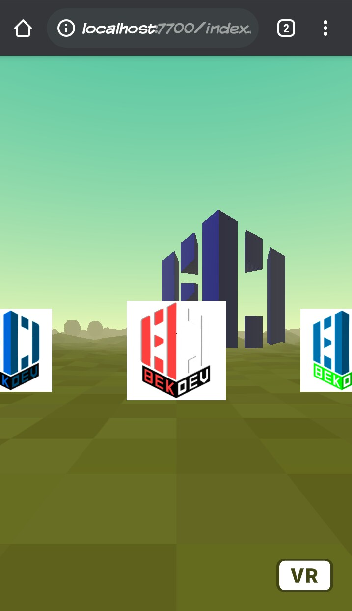

# Create Your Own Web Virtual Reality

<a href="https://raw.githubusercontent.com/Bekasi-Dev-Community/vr/main/preview.jpg"></a>

# Virtual Reality
I used A-Frame, A-Frame Is A web framework for building virtual reality experiences, A-Frame handles the 3D and WebVR boilerplate required to get running across platforms including mobile, desktop, Vive, and Rift.

# 3D Model
You can download and use 3D models or object from anywhere or create your own with Blender. For this repo, I created my own 3D model based on BekasiDev Logo with MagicaVoxel.

This BekasiDev logo vector and raster image also created by me. You can watch tutorial on my youtube channel here for create 3D model:

- [10 Menit Membuat Logo 3D (Digital Talent Scholarship)](https://www.youtube.com/watch?v=0GfNYFcDjMU&t=6s)
- [Membuat rumah dengan MagicaVoxel](https://www.youtube.com/watch?v=nbfeWj46R3c)
- [Tutorial Blender 3D Basic : View, Navigation, Transformation](https://www.youtube.com/watch?v=tEAuDC7SjsQ&t=33s)

<a href="https://www.youtube.com/watch?v=0GfNYFcDjMU&t=6s"></a>

# Live and Preview
## Preview
<a href="https://raw.githubusercontent.com/Bekasi-Dev-Community/vr/main/preview.jpg"></a>
## Live
- https://bekasidev.org/vr

# How to use this template
## Clonning
Run the following command to clone this template to your local directory:
```
$ git clone https://github.com/Bekasi-Dev-Community/vr.git

```
## Download
Use green button above and click "Download Zip" or simply click [here](https://github.com/Bekasi-Dev-Community/vr/archive/refs/heads/main.zip)
## Customizing

```
<!DOCTYPE html>
<html>

<head>
 <meta charset="utf-8">
 <title>BekasiDev - VR</title>
 <meta name="description" content="BekasiDev - Virtual Reality">
 <!--Aframe Core, not the latest release but most stable for this project-->
 <script src="https://aframe.io/releases/1.2.0/aframe.min.js"></script>
 <!--Aframe environment, template, layout and event component, you can remove it if not used -->
 <script src="https://unpkg.com/aframe-environment-component@1.2.0/dist/aframe-environment-component.min.js"></script>
 <script src="https://unpkg.com/aframe-template-component@3.x.x/dist/aframe-template-component.min.js"></script>
 <script src="https://unpkg.com/aframe-layout-component@4.x.x/dist/aframe-layout-component.min.js"></script>
 <script src="https://unpkg.com/aframe-event-set-component@5.x.x/dist/aframe-event-set-component.min.js"></script>
</head>

<body>
 <a-scene>
  <!--Load assets Object 3D, Preserve all your assets below before placing it to the scene (recommended)-->
  <a-assets>
   <!--Always Asign ID to assets item for using-->
   <a-asset-item id="bekdev-obj" src="https://raw.githubusercontent.com/MaksumRifai/voxelar/master/bekdev.obj"></a-asset-item>
   <a-asset-item id="bekdev-mtl" src="https://raw.githubusercontent.com/MaksumRifai/voxelar/master/bekdev.mtl"></a-asset-item>
     <script id="plane" type="text/html">
    <a-entity class="link"
      geometry="primitive: plane; height: 0.5; width: 0.5"
      material="shader: flat; src: ${thumb}"
      sound="on: click; src: #click-sound"
      event-set__mouseenter="scale: 1.2 1.2 1"
      event-set__mouseleave="scale: 1 1 1"
      event-set__click="_target: ${src}; _delay: 300;"></a-entity>
    </script>
    <audio id="click-sound" src="https://cdn.aframe.io/360-image-gallery-boilerplate/audio/click.ogg"></audio>
    <!-- Images and URLs. -->
    <a-link id="satu" href="https://bekasidev.org" target="_blank"></a-link>
    
    <a-link id="dua" href="https://bekasidev.org/blog" target="_blank"></a-link>
    
    <a-link id="tiga" href="https://bekasidev.org/charity" target="_blank"></a-link>
    
  </a-assets>
  <!--End of All Assets-->
  <!--Using Assets Above with assets ID, add desire position/scale/rotation and simple Animation-->
  <a-entity rotation="0 0 0" scale="0.5 0.5 0.5" position="6 0 -40" obj-model="obj: #bekdev-obj; mtl: #bekdev-mtl"
  animation="property: rotation; to: 0 360 0; loop: true; dur: 10000"
  animation__2="property: position; to: -10 2 -10; loop: true; dur: 10000"></a-entity>
  <!--Add Environtment Forest Preset, alternatively use <a-plan> and <a-sky> for custom ground and sky-->
  <a-entity environment="preset: forest; dressingAmount: 10"></a-entity>
  <!--Add Camera-->
  <a-camera>
    <a-cursor
      id="cursor"
      animation__click="property: scale; from: 0.1 0.1 0.1; to: 1 1 1; easing: easeInCubic; dur: 150; startEvents: click"
      animation__clickreset="property: scale; to: 0.1 0.1 0.1; dur: 1; startEvents: animationcomplete__click"
      animation__fusing="property: scale; from: 1 1 1; to: 0.1 0.1 0.1; easing: easeInCubic; dur: 150; startEvents: fusing"></a-cursor>
  </a-camera>
  <!--Add links and tumbnails-->
  <a-entity id="links" layout="type: line; margin: 1" position="-1 1.5 -2">
    <a-entity template="src: #plane" data-src="#satu" data-thumb="#satu-thumb"></a-entity>
    <a-entity template="src: #plane" data-src="#dua" data-thumb="#dua-thumb"></a-entity>
    <a-entity template="src: #plane" data-src="#tiga" data-thumb="#tiga-thumb"></a-entity>
  </a-entity>
  <!--End of scene, add everything you want to show above this line-->
 </a-scene>
</body>
</html>

```

In case you want to use your own models, simply replace the [.obj .mtl .png](https://en.m.wikipedia.org/wiki/Wavefront_.obj_file) files with yours. Don't forget to export your MagicaVoxel or Blender project properly.
You can refer to [A-Frame docs](https://aframe.io/docs/1.0.0/introduction/) to know everything about content and customization. You can add geometries, 3D models, videos, images. And you can customize their position, scale, rotation and so on.

For better and faster development you can use [Spck Code/Git Editor](http://play.google.com/store/apps/details?id=io.spck) for Android, I mainly use this Way.

<a href="https://github.com/MaksumRifai/360vr/blob/master/360vr.gif"></a>

You may see my other project for references.

- 360° Image VR, Add 3D bus into 360 Degree Image ([Repo](https://github.com/MaksumRifai/360vr) | [Demo](https://maksumrifai.github.io/360vr))
- Simple Object and Animation VR, Add 3D DTS logo Into Environment ([Repo](https://github.com/MaksumRifai/digitaltalent) | [Demo](https://digitaltalent.netlify.app))
- WebAR Image Tracking with Kumparan Logo Umbrella ([Repo](https://github.com/MaksumRifai/kumparan-ar) | [Demo](https://maksumrifai.github.io/kumparan-ar))
- WebAR Image Tracking with Sticker Logo BekasiDev. ([Repo](https://github.com/MaksumRifai/voxelar)) | [Demo](https://maksumrifai.github.io/voxelar/))

<a href="https://maksumrifai.github.io/360vr"></a>
<a href="https://digitaltalent.netlify.app"></a>
<a href="https://maksumrifai.github.io/kumparan-ar"></a>
<a href="https://maksumrifai.github.io/voxelar/"></a>

<br/><br/>
# References & Resources

# A-Frame Boilerplate

Web framework for building virtual reality experiences.

[Github](https://github.com/aframevr/aframe) | [Website](https://aframe.io).

Alternatively, check out the [A-Frame Starter on
glitch.com](https://glitch.com/~aframe) for a more interactive way on getting
started.

# MagicaVoxel @ephtracy

A free lightweight GPU-based voxel art editor and interactive path tracing renderer.

[Github](https://github.com/ephtracy) | [Website](https://ephtracy.github.io/) | [Demo](https://youtu.be/mfKx4j-C6nI)

## Tutorial Videos

- [Youtube: Ephtracy](https://youtu.be/d_WymsNdRBA)
- [Youtube: Aaron Robbins](https://www.youtube.com/playlist?list=PLHtmobOgsDvlikllA1MBk7pk_DWlmtR_S)
- [Youtube: Maksum Rifai](https://www.youtube.com/watch?v=0GfNYFcDjMU&t=42s)

## Articles

- [Publishing Voxel Designs from MagicaVoxel to Sketchfab](https://blog.sketchfab.com/publishing-voxel-designs-from-magicavoxel-to-sketchfab/)
- [Building with MagicaVoxel and export to A-Frame (WebVR framework)](https://aframe.io/docs/0.3.0/guides/building-with-magicavoxel.html)
- [Script for animating MagicaVoxel rendering](http://drinkdecaf.com/magicavoxel_animate)
- [Web Augumented Reality (WebAR) by Maksum Rifai](https://dev.to/maksumrifai/voxelart-web-augumented-reality-webar-2man)

### Support

<a href="https://github.com/desainerhub"></a>
<a href="https://github.com/Bekasi-Dev-Community"></a>
